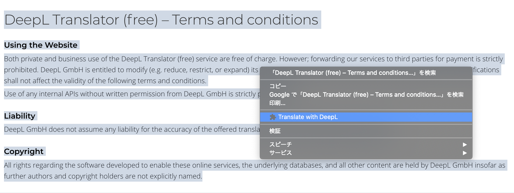

# DeepL Chrome Extension

Chromeで文章を選択した際, DeepLで翻訳するメニューを追加します.

## インストール方法

1. [リリースページ](https://github.com/natsukium/deepl-chrome-extension/releases)よりSource code (zip)をダウンロード, 展開する.

1. Chromeで[chrome://extensions](chrome://extensions)にアクセスする.

1. 右上のデベロッパーモードをオンにして, `パッケージ化されていない拡張機能を読み込む`を選択, 1.でダウンロードしたフォルダを選択する.

## 使い方
1. 翻訳したい文字列を選択後, 右クリックでコンテクストメニューを表示させる.

1. `Translate with DeepL`を選択する.
